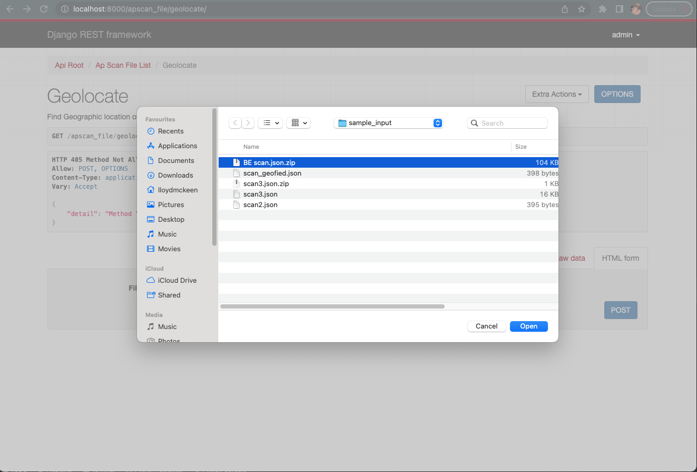

# aruba-ldmckeen-ap-scan

## Aruba AP Scan
This repository contains the codebase for a production ready, maintainable, testable service that accepts Wi-Fi access point (AP) scan result data and returns the latitude and longitude of the location at which the AP scan was performed.

## Tech Stack Details
Following is a full comprehensive list of all the requirements to use and setup this
application accordingly.

This application makes use of a python language environment, Django Rest Framework for the
RESTful API, an MVC architecture with Django and DRF combined, the DB of your choice.
(sqlite3 by default or Postgres).

It also utilises Google Geolocation API to get location specific Latitude and Longitude
details for the sensor data:
Reference - https://developers.google.com/maps/documentation/geolocation/overview

(See Developer Setup Section below for local development setup.)

### Environment Variables:
This project makes use of environment variables.
Ensure you have a .env file in your root directory, mimic the .env.template file.
If using passwords or tokens store the passwords and secrets in a vault in the cloud
and reference the value from there in your builds.

Also always backup these values on a web application such as lastpass or 1password
(Or any Web Password manager of your choice) 
https://www.lastpass.com/ 
https://1password.com/

## Running the Application
### Django Rest Framework
This application makes use of python and the Django Rest Framework.
To run the application: 
`python manage.py runserver <port-number (defaults to 8000)>` 
Migrate models to DB (If you want to make use of Object specific APScan data endpoints)
and/or a new Database: 
`python manage.py migrate`

### Caching
This application makes use of Memcached and the python Library pymemcache for caching. Ensure
Memcached is installed alongside python and make sure pymemcache is included in your requirements
file.
To toggle Caching on or off set the `USE_CACHE` boolean variable in your .env file
#### Brew:
Install: `brew install memcached` 
Start Memcache service: `brew services start memcached` 
Stop Memcache service: `brew services stop memcached` 
Restart Memcache service: `brew services restart memcached` 

See resources below for installation and reference:
https://memcached.org/
https://pypi.org/project/pymemcache/
https://pymemcache.readthedocs.io/en/latest/getting_started.html
https://realpython.com/python-memcache-efficient-caching/

To create an admin super-user: 
`python manage.py createsuperuser`

### Making an API call
The apscan endpoint takes a zipfile as input and calls the Google’s geolocation API to
return the geolocation of the sensor from the apscan data list.

#### Curl command:
`curl -i -u 'admin:Arubaapscan_1234' -H 'Content-Type: multipart/form-data' -F 'file=@BE scan.json.zip' http://localhost:8000/apscan_file/geolocate/`

#### Via browser:
(Make sure you're logged in with your DRF user. -> Login top right of browser window)
Navigate to `/apscan_file` viewset from root, and under extra actions select Geolocate.

Choose File

Make Post Request

Post Request Response

#### API tools (like Insomnia or Postman):
Post command:
Make a POST call with Multipart Form with `file` as key and zip file as value, and
basic auth enabled with username and password.

See Insomnia folder under resources for collections:
`http://localhost:8000/apscan_file/geolocate/`

Multipart-Form

Basic Auth

### Program Inputs and Outputs
* #### Input (Subset of Data in Sample Files Directory)
* i.e Sample Files to test are stored in ./sample_input

* #### Output
* Example Return:
`{
	"location": {
		"lat": -33.920373,
		"lng": 25.5912481
	},
	"accuracy": 20
}`

## ==================================================================
## Developer Setup
### Pre-requisites
When setting up a local environment for developing ensure you are using a local
virtual environment for optimal sand-boxing and testing to minimize clashes with
existing setups or environments on your machine.

### Virtual Environment Setup
##### Pyenv
(Recommendation: Use Pyenv where possible to manage your python installations)

Useful pyenv commands: 
`pyenv install --list` - List all pyenv versions on offer 
`pyenv versions` - List pyenv versions on your machine 
`pyenv install <python version>` - Install python version eg. pyenv install 3.8.7 
`pyenv virtualenvs` - List virtualenv versions 
`pyenv virtualenv <python version> <venv-name>` - Create Pyenv Virtual Environment 
`pyenv activate <name>` - Activate Virtual Environment 
`pyenv deactivate` - Exit Virtual Environment 
`pyenv virtualenv-delete <venv-name>` - Delete Virtual Environment 

To note (On Mac): 
Make sure to add the envs to your bash or zsh profiles (.zshrc/.zprofile, .bashrc): 
`export PYENV_ROOT="$HOME/.pyenv"` 
`export PATH="$PYENV_ROOT/bin:$PATH"` 
`eval "$(pyenv init --path)"` 
`eval "$(pyenv init -)"`

###### Standalone virtualenv
`python3 -m pip install --user virtualenv` 
`python3 -m venv env` 
`source ./env/bin/activate`

##### Resources
https://github.com/pyenv/pyenv 
https://github.com/pyenv/pyenv-virtualenv 
*Tutorial* - https://realpython.com/intro-to-pyenv/

### Python Version
This application makes use of Python 3.8.7 
Please ensure you have the correct Python version installed.

### Git Config
In order to ensure that your local git structure mirrors that of the broader style
requirements, you must setup the use of git hooks. This is done via the `pre-commit`
application. If on a Mac, ensure you `brew install pre-commit` (Sometimes you need: `xcode-select --install`)

Run the following configuration in your local repo instance: 
`git config core.hooksPath .githooks`

Make sure all the dev requirements are installed by running: 
`pip install -r dev-requirements.txt`

Make sure all the application requirements are installed by running: 
`pip install -r requirements.txt`

Configure pre-commit
`pre-commit install`

###### Troubleshooting
* Pip - If you're Pip issues not installing packages correctly please take note you may need to upgrade your pip installation:
`pip install --upgrade pip`

###### Common git commands when pushing to repo :* 
* Checkout to new branch:
 * `git checkout -b "feature/<ticket-id>-<short-descriptor>"`
 * eg. `git checkout -b feature/ARUBA-101-new-feature`
* Set upstream branch:
 * `git push --set-upstream origin feature/ARUBA-101-new-feature`
*Stage all changed files in current directory for commit:
 * `git add .`
* Check status of current branch:
 * `git status`
* Commit changes:
 * `git commit -m "<descriptive-message>"`

*Git Tutorials*:
`https://guides.github.com/activities/hello-world/`

#### Environment Variables
As mentioned above please make sure to add your own Environment Variable file with the
necessary Variables i.e .env
(see .env.template for an example of the env variables used)

To Note: 
Application code resides in the apps folder and
testing code resides in the tests folder

### Unit Testing
This Application make use of the Pytest unit testing Library. 
To run the unit tests you can use the single command: 
`pytest` from the root directory of the repo.

Example output:

For more information and resources on Pytest please see Pytest docs:
https://docs.pytest.org/en/7.2.x/
